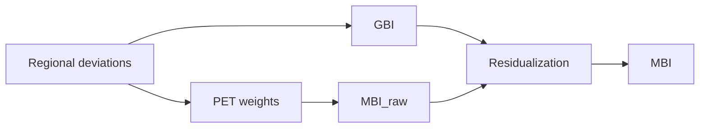

# MBI-pipeline
A modular R-based pipeline for computing Metabolic Brain Index (MBI) metrics by integrating MRI-based normative deviations with PET-derived metabolic priors.

This repository is designed to be:
- Self-contained: each stage is runnable end-to-end from the command line.
- Generalizable: minimal assumptions about cohort or dataset specifics; paths and parameters live in a config file.
- Composable: run the full pipeline or only the stages you need.

---

## Conceptual overview

### **1. GBI — Global Brain Index**
Unweighted whole-brain deviation score (mean deviation across regions).

### **2. MBI_raw — PET-weighted deviation index**
Weighted deviation score using region-specific PET metabolic weights.

### **3. MBI — alignment metric (formerly MDA)**
Residual of the model:

    MBI_raw ~ GBI

This isolates PET-weighted deviation **not explained by global deviation**, making MBI the primary interpretable alignment measure.

---

## Conceptual diagram



---

## Repository layout

### scripts/
  Pipeline entrypoints. Each script is intended to run non-interactively from the command line.

### helpers/
  Reusable functions sourced by scripts (I/O, QC, modelling, aggregation).

### jobs/
  HPC or cluster job templates and wrappers.

### extras/
  Optional utilities, exploratory scripts, and QC helpers not required for the core pipeline.

### examples/toy/
  Fully self-contained toy example with synthetic data and runnable scripts.

### config_generic.yaml
  Example configuration file defining paths and parameters.

---

## Quick run example

From the repository root, run the toy example with:

```
Rscript examples/toy/run_toy_example.R
```

Expected outputs include computed indices and basic QC summaries written to the toy example output directory.

---

## Installation

R requirements:
- R version 4.2 or newer

Dependency management:
Using renv is strongly recommended for reproducibility.

In R:
install.packages("renv")
renv::restore()

If renv is not used, install required packages manually when prompted by the scripts.


## Running the pipeline

Recommended workflow:

1. Copy the generic configuration file:
cp config_generic.yaml config.yaml

2. Edit config.yaml to point to your data and desired output directory.

3. Run individual pipeline stages:
Rscript scripts/STAGE_NAME.R --config config.yaml

A full launcher can be used:
bash scripts/run_all.sh --config config.yaml


Typical pipeline stages (high-level)

- PET mapping or preparation (optional)
  Registers or prepares PET priors for downstream use.

- PET weight extraction
  Produces a region-level table of metabolic weights.

- Normative modelling
  Computes region-wise deviations with appropriate covariates and QC.

- Index computation
  Aggregates deviations into GBI, MBI_raw, and MBI.

- Downstream analysis (optional)
  Associations, plots, and summary tables.


## Configuration

All cohort-specific paths and parameters should be defined in the YAML configuration file.

Typical configuration entries include:
- Input paths for deviations or raw imaging data
- PET priors or PET weight tables
- Parcellation or region lookup tables
- Output directory
- Modelling parameters (covariates, winsorization thresholds, transforms)
- Compute options (threads, overwrite flags, QC toggles)

See config_generic.yaml for example keys and expected structure.


## Inputs and outputs

Inputs:
- Subject by region deviation matrix or inputs required to compute deviations
- Region-level PET weight table
- Consistent region identifiers across inputs

Outputs:
- Per-subject indices table containing GBI, MBI_raw, and MBI
- QC summaries (missingness, coverage, distributions)
- Log files including session information


## Reproducibility

Recommended practices:
- Use renv.lock to pin R package versions
- Save sessionInfo() for each run
- Avoid hard-coded paths in scripts


## Citing

If you use this pipeline in academic work, please cite via the CITATION.cff file.


## Contributing

Bug reports and feature requests are welcome.
Please include:
- The stage script used
- A minimal configuration snippet
- Relevant log output


## License

MIT License. See LICENSE for details.
