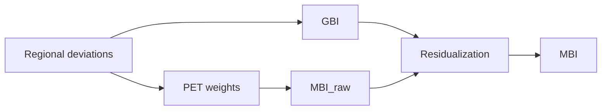

# MBI-pipeline
A modular R-based pipeline for computing **Metabolic Brain Index (MBI)** metrics by integrating MRI-based normative deviations with PET-derived metabolic priors.

This repository is designed to be:
- Self-contained: each stage is runnable end-to-end from the command line.
- Generalizable: minimal assumptions about cohort or dataset specifics; paths and parameters live in a config file.
- Composable: run the full pipeline or only the stages you need.

---

## Conceptual overview

### **1. GBI — Global Brain Index**
Unweighted whole-brain deviation score (mean deviation across regions).

### **2. MBI_raw — PET-weighted deviation index**
Weighted deviation score using region-specific PET metabolic weights.

### **3. MBI — alignment metric**
Residual of the model:

    MBI_raw ~ GBI

This isolates PET-weighted deviation **not explained by global deviation**, making MBI the primary interpretable alignment measure.

---

## Conceptual diagram



---


## Quick run example

From the repository root, run the toy example with:

```
Rscript examples/toy/run_toy_example.R
```

Expected outputs include computed indices and basic QC summaries written to the toy example output directory.

---

## Conceptual workflow

1. **PET feature extraction**  
   Parcellate PET maps and derive region-wise metabolic weights.

2. **Normative modelling (MRI)**  
   Estimate region-wise deviations (e.g. z-scores) from a normative model with covariates.

3. **Index computation**  
   Aggregate deviations into GBI, MBI_raw, and MBI.

4. **PET–MBI alignment QC (optional)**  
   Evaluate how PET weights relate to MRI deviations and derived indices.

---

## Repository structure

scripts/  
  Command-line entrypoints for each pipeline stage.

helpers/  
  Reusable functions sourced by scripts (normative modelling, PET extraction, aggregation, QC).

extras/  
  Optional utilities and calibration tools (not required for the core pipeline).

jobs/  
  Example Slurm batch scripts for running the pipeline on HPC systems.

config_generic.yaml  
  Example configuration file defining inputs, outputs, and modelling parameters.

DESCRIPTION  
  Package-style metadata (dependencies, authorship, license).

---

## Pipeline stages

### Stage 01 — Extract PET values
**Script:** `scripts/01_extract_petvals.R`  
**Helpers:** `helpers/pet_parcel_extract.R`

Parcellates PET maps and computes region-wise PET summaries (e.g. median FDG uptake).

**Key output (example):**
```
out/extract_pet/pet_fdg_featMedians.txt
```

---

### Stage 02 — Run normative modelling
**Script:** `scripts/02_run_normdevs.R`  
**Helpers:** `helpers/normative_modeling.R`

Fits region-wise normative models and outputs deviation scores with QC summaries.

**Key outputs (example):**
```
out/normdev/deviations_z_long.txt
out/normdev/qc_normdev.tsv
```

---

### Stage 03 — Compute MBI indices
**Script:** `scripts/03_run_mbi.R`  
**Helpers:** `helpers/compute_mbi.R`

Aggregates regional deviations into subject-level indices.

**Key output (example):**
```
out/compute_mbi/mbi_flagship_scores.txt
```
Columns typically include:
```
id | gbi | mbi_raw | mbi
```

---

### Stage 04 — Relate MBI to PET (QC / diagnostics)
**Script:** `scripts/04_relate_mbi_pet.R`  
**Helpers:** `helpers/relate_pet_funcs.R`

Evaluates alignment between PET weights and MRI deviations / MBI metrics.

**Key outputs (example):**
```
out/qc_pet_align/
```

---

### Optional: run entire pipeline
**Script:** `scripts/run_all.sh`

Sequentially runs stages 01–04 (and optional PET preparation) using a single config file.

---

## Configuration

All cohort-specific settings live in a YAML configuration file.

Start by copying:
```
cp config_generic.yaml config.yaml
```

The configuration defines:
- Input feature tables (MRI features, PET maps)
- Parcellation and feature mappings
- Covariates for normative modelling
- Output directory structure
- Winsorization and weighting options
- Compute / overwrite flags

The pipeline is intentionally strict about configuration to avoid hidden assumptions.

---

## Running the pipeline

Example (single stage):
```
Rscript scripts/02_run_normdevs.R --config config.yaml
```

Run everything:
```
bash scripts/run_all.sh --config config.yaml
```

All scripts are intended to run non-interactively.

---

## Inputs and outputs (contracts)

**Inputs (typical):**
- Subject × region MRI feature table
- Region lookup / feature map
- PET map(s) or precomputed PET region weights
- Covariate table (age, sex, scanner variables, etc.)

**Outputs:**
- Subject-level MBI metrics (GBI, MBI_raw, MBI)
- QC tables and summaries
- Log files and session information

---

## Reproducibility

- All scripts report session information.
- Configuration files fully specify analysis parameters.
- The repo includes LICENSE, CITATION.cff, and a toy example for validation.

---

## License and citation

MIT License.  
If you use this pipeline in academic work, please cite via the included `CITATION.cff`.

---

## Notes

This repository prioritizes **clarity and methodological transparency** over maximal automation.
Users are encouraged to inspect intermediate outputs and adapt stages as needed.


## Contributing

Bug reports and feature requests are welcome.
Please include:
- The stage script used
- A minimal configuration snippet
- Relevant log output


